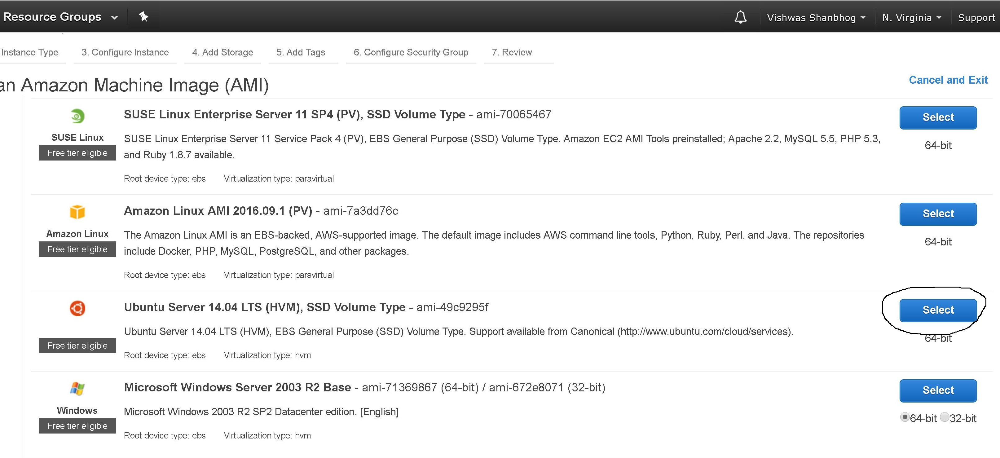
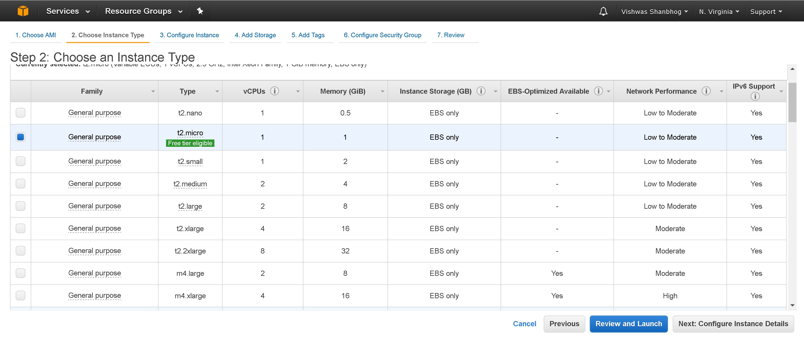
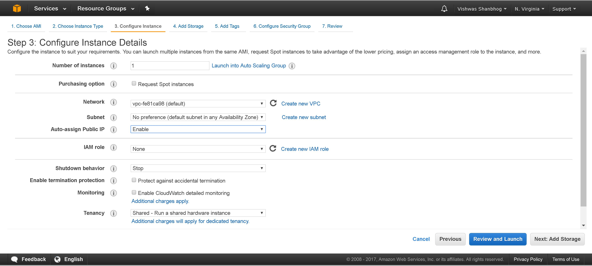
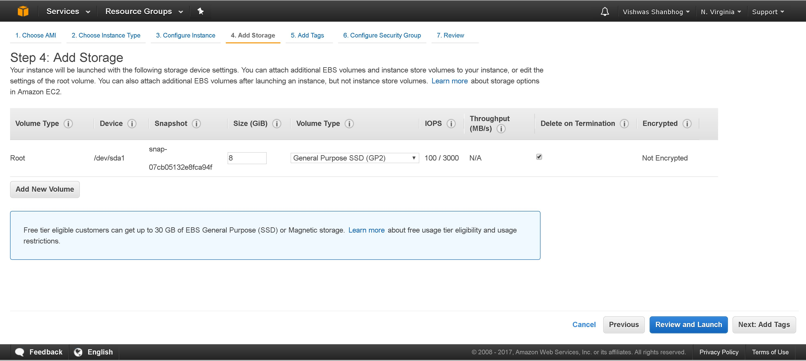
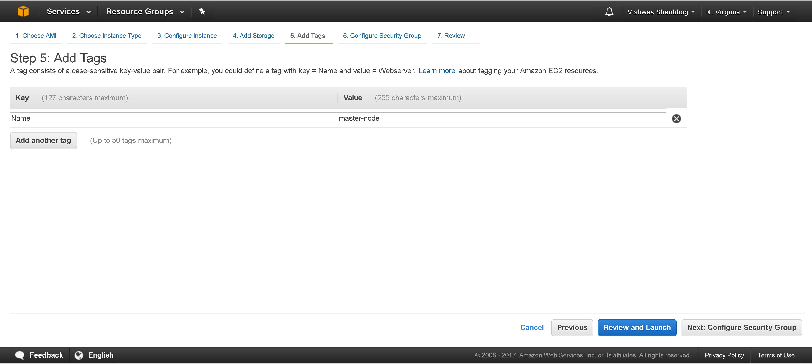
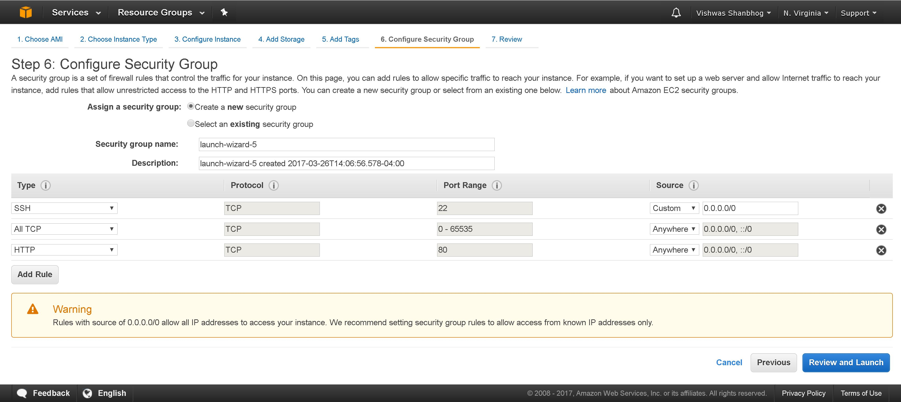
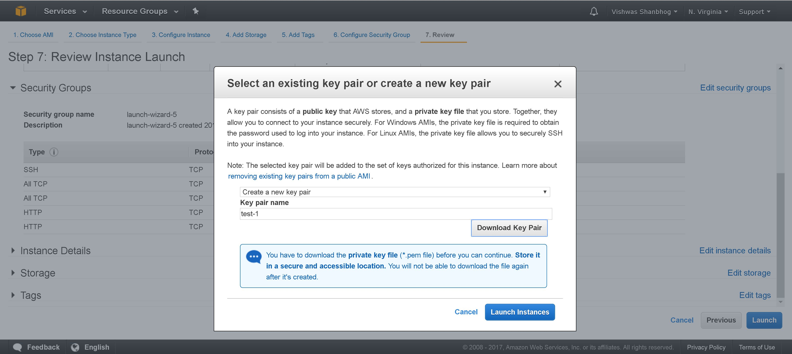

# Setup of Hyperledger Cello using AWS EC2 Ubuntu 14.04 instances

## Steps for creating an AWS instance and Cello setup.

1. If you dont have an Amazon AWS account, create one.

2. After logging into AWS console, in the services section, select EC2. 

3. Create atleast 2 instances.One for master node and one for host. Click launch instance. Select Ubuntu 14.04 image as shown in figure .

4. Select the instance type depending on requirements as shown in figure .

5. Add more configuration details as needed. Make sure that Auto-assign public IP is enabled. For your reference you can view the below image .

6. Add necessary storage.See image: .

7. Add tags as needed. .

8. Create a security group and define rules for instances.I have kept minimum security by allowing http,tcp and ssh available to internet. Try to make it as secure as possible..

9. Download private key for ssh into the instances and launch instance. .

10. From terminal, you can ssh into the AWS Ubuntu instance using command- *sudo ssh -i yourprivatekey.pem ubuntu@IP*.

11. Install docker and docker-compose. Follow the Cello master node setup as given in following document . In the host, follow the worker node setup as given in link . Other steps are the same for both master and worker node.

12. Once done, in the master node, you should be able to run the command *docker -H Worker_Node_IP:2375 version*.

Example: You should get something like this in the master node-

ubuntu@ip-172-31-34-249:~$ docker -H 54.87.59.141:2375 version
Client:
 Version:      17.03.0-ce
 API version:  1.26
 Go version:   go1.7.5
 Git commit:   3a232c8
 Built:        Tue Feb 28 07:57:58 2017
 OS/Arch:      linux/amd64

Server:
 Version:      17.03.0-ce
 API version:  1.26 (minimum version 1.12)
 Go version:   go1.7.5
 Git commit:   3a232c8
 Built:        Tue Feb 28 07:57:58 2017
 OS/Arch:      linux/amd64
 Experimental: false

13. You should be able to open the link *http://MasternodeIP:8080* .You can login and add hosts. Once the hosts are added, you can create blockchains.

